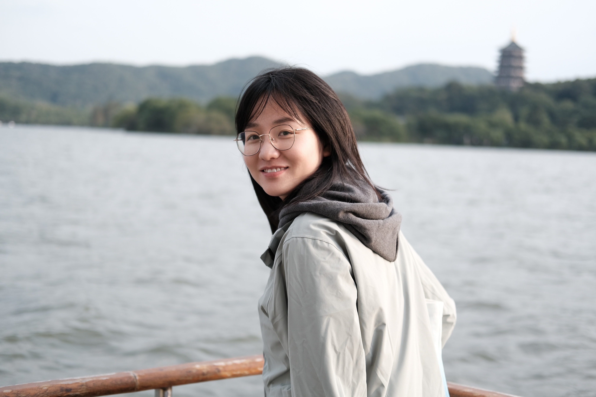

Date: 2022-06-10
Title: About
Tags: about
Slug: about

# About

SSP is a not-profit scientific community of scholars from around the world. Our current work mainly focuses on the extraction and mining of sentiment in Chinese Weibo data.

SSP is spired by [SSP](https://ultra.fandom.com/wiki/SSP_(Something_Search_People)) in Ultra man.

## Peoples

### Xiaokang Fu

{:width="30%" }

Dr. Xiaokang Fu is a postdoctoral researcher in State Key Laboratory of Information Engineering in Surveying, Mapping and Remote Sensing, Wuhan University, and a Visiting Fellow at the CGA of Harvard University. His research interests include Geostatistics and Geoinformatics (GIS), Urban Computing, Social Media Data Mining, Emergency Response, and healthy cities. Since 2020, as one of the core members, he has participated in the workflow-based spatial analysis platform project and COVID-19 quick response project initiated by the CGA. 

Contact Information: xiaokang_fu@fas.harvard.edu

## Mengling Qiao

{:width="50%" }

Dr. MENGLING QIAO is currently a postdoc in the Department of Geography and Resource Management, The Chinese University of Hong Kong. Her research interests include urban geography, human mobility, GeoHealth, and socio-spatial computing. Currently, she is focusing on the study of spatiotemporal impacts of factors and community vulnerability on COVID-19 and the air quality for smart cities.

Contact Information:
menglqiao@whu.edu.cn

## Dongyang Wang

{:width="50%" }

Dongyang Wang is currently a phD candidate in the State Key Laboratory of Information Engineering in Surveying, Mapping and Remote Sensing, Wuhan University. Her research interests include Social Sensing and Urban Informatics. Currently, she is focusing on the study of spatiotemporal patterns and influencing factors of urban emotion based on the social media data.

Contact Information:
wangdongyang@whu.edu.cn

